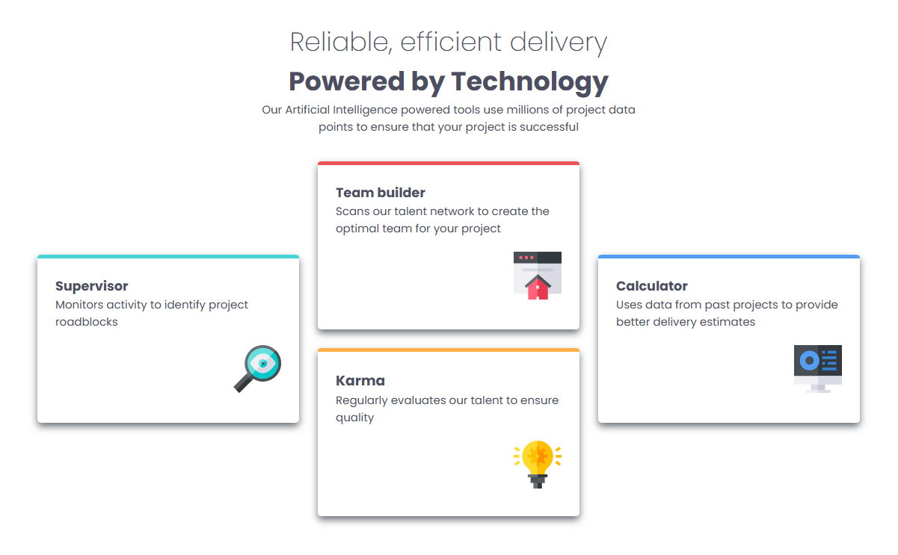
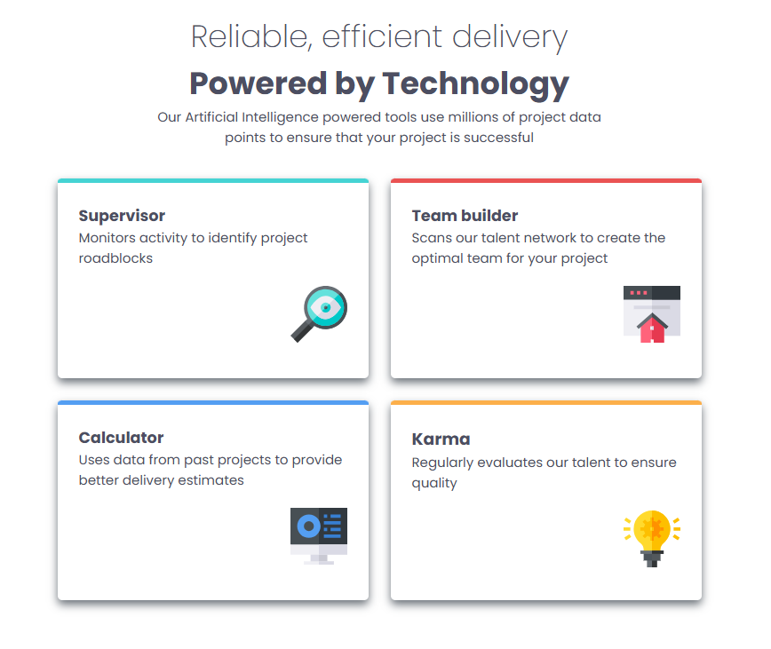
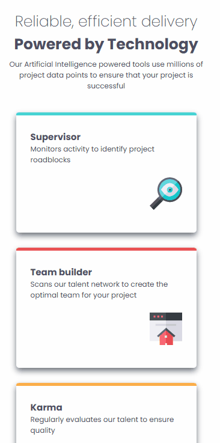

# Frontend Mentor - Solução Responsiva para a Seção de Recursos de Quatro Cartas

Esta é a minha solução para o desafio [Four card feature section challenge on Frontend Mentor](https://www.frontendmentor.io/challenges/four-card-feature-section-weK1eFYK) do Frontend Mentor. Os desafios do Frontend Mentor ajudam a aprimorar habilidades de codificação através da criação de projetos realistas e focados em boas práticas de desenvolvimento.

## 🗂️ Índice

- [Visão Geral](#visão-geral)
  - [Capturas de Tela](#capturas-de-tela)
  - [Links](#links)
- [Meu Processo](#meu-processo)
  - [Construído com](#construído-com)
  - [O que Aprendi](#o-que-aprendi)
  - [Desenvolvimento Contínuo](#desenvolvimento-contínuo)
  - [Desafios que Encontrei](#desafios-que-enfrentei)
- [Autor](#autor)
- [Contato](#contato)

---

## Visão Geral 

### Capturas de Tela
Layout para Web/desktop:

Layout para tablets:

Layout para celulares:

### Vale ressaltar que ainda existem mais duas versões para celulares.

### Links

- URL do site publicado: [Clique aqui]()

---

## Meu Processo 

### Construído com

- HTML5 semântico
- CSS3 com propriedades personalizadas (CSS Variables)
- Flexbox e CSS Grid para layout responsivo
- Fluxo de trabalho Desktop-first
- Controle de versão com Git

### O que Aprendi

- Neste projeto, aprofundei ainda mais minhas habilidades em HTML e CSS, explorando melhor as propriedades do CSS Grid para aprimorar o design e otimizá-lo para diferentes tamanhos de tela.

### Desenvolvimento Contínuo

- Estou comprometido em desenvolver continuamente minhas habilidades em HTML, CSS, Git e GitHub, e pretendo aplicar novos conhecimentos e ideias em projetos futuros, visando criar soluções cada vez mais modernas, eficientes e alinhadas com as melhores práticas do desenvolvimento web.

---
### Desafios que Enfrentei

- Por ainda não estar totalmente familiarizado com o CSS Grid, enfrentei algumas dificuldades na organização do layout e precisei refazê-lo em alguns momentos. No entanto, consegui superar esse desafio com sucesso e fiquei satisfeito por ter ampliado meu aprendizado durante o processo.

## Autor

- GitHub - [Guilherme-dDiniz](https://github.com/Guilherme-dDiniz)
- Frontend Mentor - [@Guilherme-dDiniz](https://www.frontendmentor.io/profile/Guilherme-dDiniz)